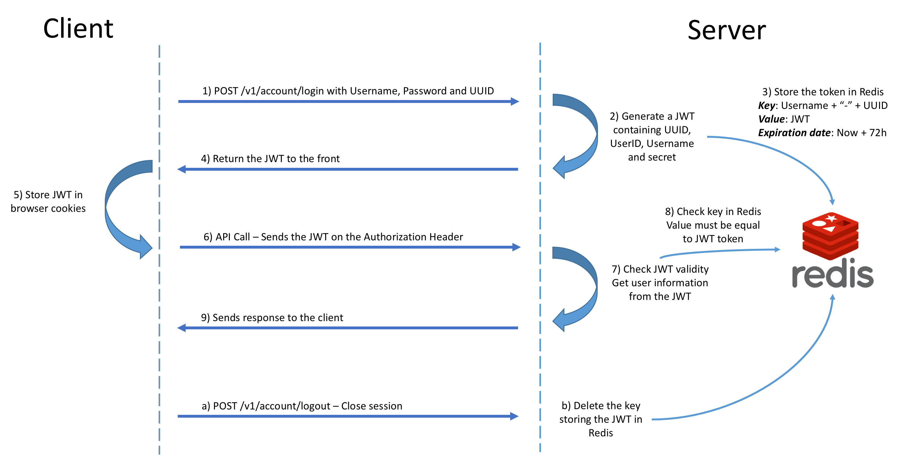

# API routes details

## Table of Contents
- [Accounts](./#accounts)
- [Mails](./#mails)

### Accounts
#### POST - /v1/account/register
```
JSON Body :
  {
    "username": string,
    "email": string,
    "lastname": string,
    "firstname": string,
    "password": string,
    "rePassword": string
  }
```
This route allows to handle the user registration by using the data sent in the body  
- Body Fields can't be empty, it must be a valid username (a-zA-Z0-9.- _ \\ {6,64}), firstname
and lastname (a-zA-Z - {6,64}), password (a-zA-Z0-9 {8,100} - At least one of each) and
email address (max 254)
- Password and reentered password must be identical

If a least one of points below is not respected :  
&nbsp;&nbsp;&nbsp;&nbsp;&nbsp;&nbsp;-> Return an error - HTTP Code 406 Not Acceptable - JSON Content "Error: <error details>"  
Check in our PostgreSQL database, if the Username or/and Email address are already used  
&nbsp;&nbsp;&nbsp;&nbsp;&nbsp;&nbsp;-> Return an error - HTTP Code 406 Not Acceptable - JSON Content "Error: \<details\> already used"  
Encrypt the password and insert in the database the new user  
Return HTTP Code 201 Status Created

___

#### POST - /v1/account/login
```
JSON Body :
  {
    "username": string,
    "password": string,
    "uuid": string, // Universally unique identifier from the user's web browser
  }
```
This route allows to handle the user authentication by using the data sent in the body.  
If the Username from the body is not in our PostgreSQL database  
&nbsp;&nbsp;&nbsp;&nbsp;&nbsp;&nbsp;-> Return an error - HTTP Code 403 Forbidden - JSON Content "Error: User or password incorrect"  
If the Password from the body does not match with the data linked to the username in our PostgreSQL database  
&nbsp;&nbsp;&nbsp;&nbsp;&nbsp;&nbsp;-> Return an error - HTTP Code 403 Forbidden - JSON Content "Error: User or password incorrect"

Generate a JSON Web Token (JWT) with payload content :
```
{
 "iss":      "matcha.com",
 "sub":      UUID, // From body
 "userId":   UserID, // From body
 "username": Username, // From body
 "iat":      now, // As time the number of seconds elapsed since January 1, 1970 UTC
 "exp":      now + 72h, // As time the number of seconds elapsed since January 1, 1970 UTC
}
```
Set in the Redis database the key `Username + "-" + UUID` with the JWT as value  
Return HTTP Code 200 Status OK - JSON Content "token": JWT

> All the routes following the login, must contain in the header :  
> &nbsp;&nbsp;&nbsp;&nbsp;&nbsp;&nbsp;**_Authorization: Bearer \<User_JWT\>_**  
> This token will be checked by the middleware for authentication.

___

#### JSON Web Token explanation

###### Basics
JSON Web Token is a JSON-based open standard (RFC 7519) for creating access tokens that assert some number of claims.
This token is composed of :
- Header
```
{
  "alg": "HS256",
  "typ":"JWT",
}
```
- Payload that contains data such as iss, sub, iat (token issued at), exp (token expiration date) and other personal data (userId, username)
- Signature - A secret string

>token = encodeBase64Url(header) + '.' + encodeBase64Url(payload) + '.' + encodeBase64Url(signature)

JWT is then used to identify the user, it is sent through the header **_Authorization: Bearer \<User_JWT\>_** and
we can decode the token to collect data from payload (check validity, private data).

###### JWT in this project


___

#### POST - /v1/account/logout
This route allows to handle the user logout  
Delete in the Redis database the key `Username + "-" + UUID` allowing to validate the JWT token, using context data  
If deletion failed  
&nbsp;&nbsp;&nbsp;&nbsp;&nbsp;&nbsp;-> Return an error - HTTP Code 500 Internal Server Error - JSON Content "Error: Failed to delete token"  
Return HTTP Code 202 Status Accepted

___

#### POST - /v1/account/resetpassword
This route allows to an user to update his password, using a unique url.
```
JSON Body :
  {
    "randomToken": string,
    "password": string,
    "rePassword": string,
  }
```
If random_token, password or re-password is empty, passwords doesn't match or password is not valid  
&nbsp;&nbsp;&nbsp;&nbsp;&nbsp;&nbsp;-> Return an error - HTTP Code 406 Not Acceptable - JSON Content "Error: \<details\>"  
Get user data from random_token  
If random_token doesn't match with any data in the table Users in the database  
&nbsp;&nbsp;&nbsp;&nbsp;&nbsp;&nbsp;-> Return an error - HTTP Code 400 Bad Request - JSON Content "Error: Random token does not exists in the database"  
Encrypt with bcrypt the password  
Update the database with the new password and delete random_token content in the database  
Return HTTP Code 200 Status Accepted

___

### Mails
#### POST - /v1/mails/forgotpassword
This route allows to send forgot password email.
```
JSON Body :
  {
    "email": string,
    "test": bool, // Avoid to send real email during the tests
  }
```
If email address from the body is empty or not a valid email  
&nbsp;&nbsp;&nbsp;&nbsp;&nbsp;&nbsp;-> Return an error - HTTP Code 400 Bad Request - JSON Content "Error: Email address \<details\>"  
If email address from the body doesn't match with any user in the database  
&nbsp;&nbsp;&nbsp;&nbsp;&nbsp;&nbsp;-> Return an error - HTTP Code 400 Bad Request - JSON Content "Error: Email address does not exists in the database"  
Generate a unique token using user firstname and current time  
Insert the unique token in the user row of the table Users in the database  
Send mail (http://localhost:3000/resetpassword/:token) :
- If in the body test is true, then the route with return HTTP Code 200 StatusOK with a JSON containing the email, fullname and forgotPasswordUrl, this is used for tests.
- Else send 'Forgot password' email to the email addres from body with variables firstname and forgotPasswordUrl used in the mailjet template, return HTTP Code 202 Status Accepted
